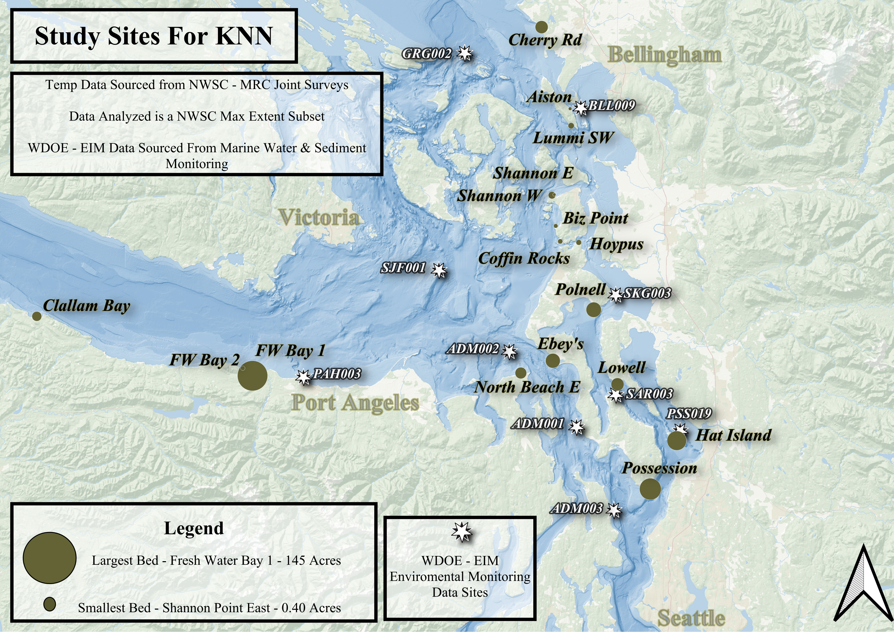

# Temperature Effects on Kelp: Dealing with Missing Temperature Imputation

>  We will assess the use of k-Nearest Neighbors regression methods for imputing missing temperature data in a Northwest Strait Commission (NWSC) - Marine Resource Committee (MRC) kelp forest monitoring dataset using Washington Department of Ecology (WDOE), Environmental Information Management (EIM) database containing temperature observations at variable depths, times, and distances from the aforementioned kelp forests.

---

## Project Overview

- **Objective:** There is often missing data and we want to determine the best method for imputing. This in turn will enable analysis of kelp monitoring efforts as they relate to temperature.
- **Domain:** Ecology
- **Key Techniques:** knn regression, time series

---

## Project Structure

```
├── data/                 # Raw and processed data
├── code/                 # Jupyter notebooks and Python scripts
├── reports/              # Generated reports and visualizations
├── requirements.txt      # Dependencies
└── README.md             # Project documentation
```

---

## Data

- **Source:**
- NWS-MRC Kayak Kelp Monitoring Data
 	- Community Science Monitoring Efforts Performed by the Marine Resource Committees (MRCs), 	funded and managed by Northwest 		Straits Commission (NWSC) 2015 - 2024.
	- We have been given special permission to use a larger data set, however, the public version is available at: 						https://experience.arcgis.com/experience/5416ae7c51ae4244a1a42ba679c1479f/page/ 
  
- **Description:**
	- A census dataset created with the express aim to monitor the location, spatial migration, and area of kelp forests around 		the Puget Sound. In addition this data set contains Sea Surface Temperature Data and Kelp Expression Area in Acres at 31 sites 		across the Salish Sea.

-  **License:**
	Data used in our specific project is not for public use or publication. 
  

- **Source:**
- Washington State Department of Ecology (2026).
	- Environmental Information Management database [Environmental monitoring data portal]. Washington State Department of Ecology.
	- Available at: https://ecology.wa.gov/research-data/data-resources/environmental-information-management-database (accessed Feb 	14, 2026).
  
- **Description:**
	- A searchable database of environmental monitoring data including air, water, soil, sediment, and biological sampling. Our 		specific sub database is that of the Water Parameter and Sediment Monitoring which has been tracking sediment chemistry and 		water chemistry (including temperature, dissolved oxygen, light attenuation, etc) since 1999.
  
- **License:**
	Copyright © 1994-2024. Washington State Department of Ecology. All rights reserved.
	Web Communications Manager, Washington State Department of Ecology, PO Box 47600, Olympia, WA 98504-7600, 360-918-1483.


---

## Analysis

The notebooks should be run in this order:
	1.	final_clean #includes the entire cleaning pipeline, including simplification, attribute standardization, kelp site lat/lon join, and basic exploratory data analysis.
	2.	imputation #includes regression-related exploratory data analysis, train-test splits, and three variations of kNN (unscaled, scaled, and GridSearchCV), as well as pertinent regression and error plots. Using the best model, GridSearchCV, it imputes relevant missing temperature values and explores their validity.

---

## Results

kNN imputations were successful and yielded interesting results. Three parallel models were tested including a model using scaled features, a model using unscaled features, and a model optimized using GridSearchCV. Model performance improved modestly across these variations with the best performing model being (GridSearchCV). This model achieved an MSE of 6.13, MAE of approximately 2.01°C, and an R^2 of −0.56. Although the negative R^2 values indicate that the model performs worse simple mean prediction of the test data, we are confident differences between the EIM and kelp datasets are the culprit; especialy considering compared data and predicted value distrobutions. With only eighteen kelp observations required for imputation the difference between this magnitude and the model was trained on, the larger WDOE - EIM dataset; it can be expected the imputed values would tend to represent conservative estimates that follow the general trends in the greater watercolumn rather than reproducing the full local variability at kelp sites.

Depsite these considerations, the best model was able to estimate temperatures within roughly ±2°C.

While it is true, the kNN approach does not capture the full complexity of the system, it provides a framework to produce plausible temperature estimates that align with the general temporal and spatial patterns of the greater region. With this in mind, we propose this to be a reasonable proof-of-concept for filling missing values in the kelp dataset.

Future attempts should aim to incoorperate the a higher degree of localized variability that is characterstic of the kelp forest study sites by using kNN to select values intended to train more complex regression modeling. From a spatial-temporal perspective some example regression methods could be [Gaussian Regression](https://www.mathworks.com/help/stats/gaussian-process-regression-models.html) or [Generalized Additive Modeling](https://www.mathworks.com/help/stats/generalized-additive-model-regression.html), however, these are outside of our current understanding and scope for the project.

---

## Authors
- Carter Ellis- [@EllisWebb](github.com/EllisWebb)

- Ahrial Young - [@ayoung42](https://github.com/ayoung42)
---

## License

Licenses outside of data copyright are not applicable. 

---

## Acknowledgements
Thanks to NWSC Employees Jeff Whitty, Leah Skare, and Suzanne Shull for collating and QA/QCing the data, not to mention the day to day work they do to manage the Kelp Monitoring Data. 

Thanks to all MRC volunteers for hundreds of hours on the water collecting data. 

Thanks to Sydney Golden for her work in previous courses exploring correlations between temperature and kelp health. 


